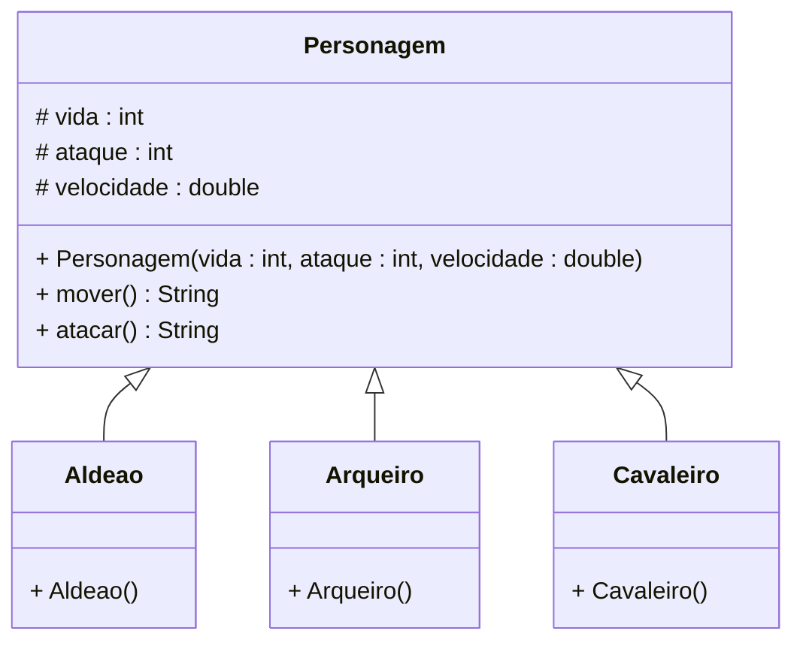
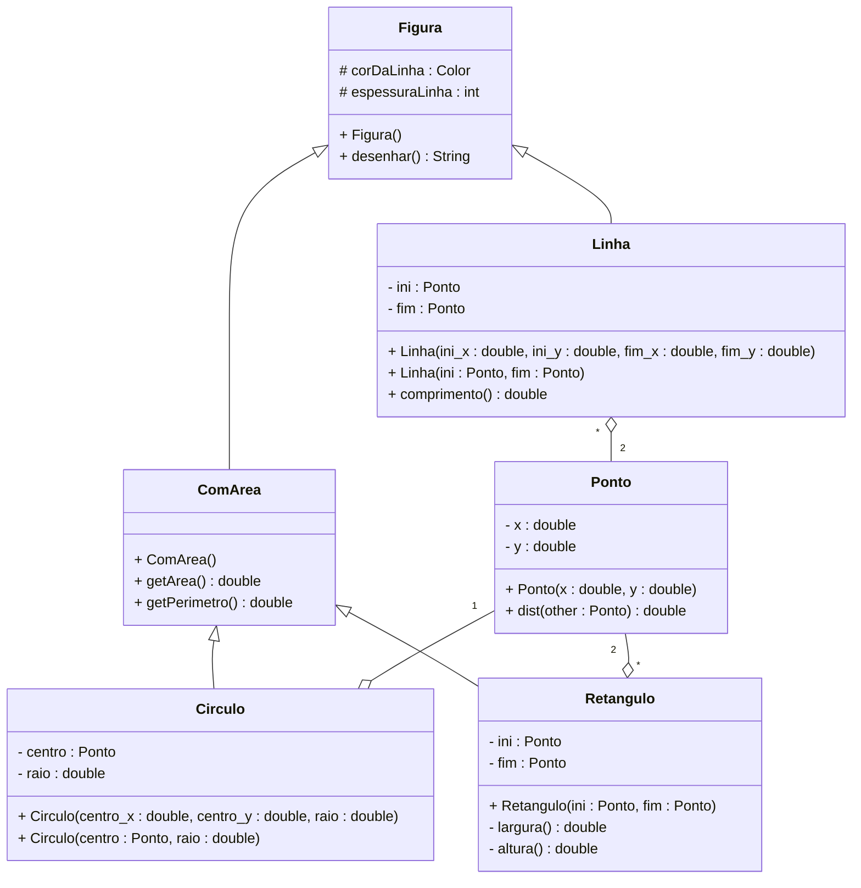

## Diagramas de classe

### Java of Empires

```mermaid
classDiagram
    class Personagem {
        # vida : int
        # ataque : int
        # velocidade : double
        + Personagem(vida : int, ataque : int, velocidade : double)
        + mover() String
        + atacar() String
    }
    
    class Aldeao {
        + Aldeao()
    }
    
    class Arqueiro {
        + Arqueiro()
    }
    
    class Cavaleiro {
        + Cavaleiro()
    }
    
    Personagem <|-- Aldeao
    Personagem <|-- Arqueiro
    Personagem <|-- Cavaleiro
```

### Geometria

```mermaid
classDiagram
    class Ponto {
        - x : double
        - y : double
        + Ponto(x : double, y : double)
        + dist(other : Ponto) double
    }
    
    class Figura {
        # corDaLinha : Color
        # espessuraLinha : int
        + Figura()
        + desenhar() String
    }
    
    class Linha {
        - ini : Ponto
        - fim : Ponto
        + Linha(ini_x : double, ini_y : double, fim_x : double, fim_y : double)
        + Linha(ini : Ponto, fim : Ponto)
        + comprimento() double
    }
    
    Figura <|-- Linha
    Linha "*" o-- "2" Ponto
    
    class ComArea {
        + ComArea()
        + getArea() double
        + getPerimetro() double
    }
    
    Figura <|-- ComArea
    
    class Circulo {
        - centro : Ponto
        - raio : double
        + Circulo(centro_x : double, centro_y : double, raio : double)
        + Circulo(centro : Ponto, raio : double)
    }
    
    ComArea <|-- Circulo
    Ponto "1" --o "*" Circulo
    
    class Retangulo {
        - ini : Ponto
        - fim : Ponto
        + Retangulo(ini : Ponto, fim : Ponto)
        - largura() double
        - altura() double
    }
    
    ComArea <|-- Retangulo
    Ponto "2" --o "*" Retangulo
    
    
    
    
```